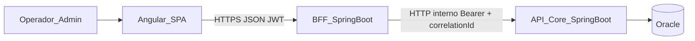
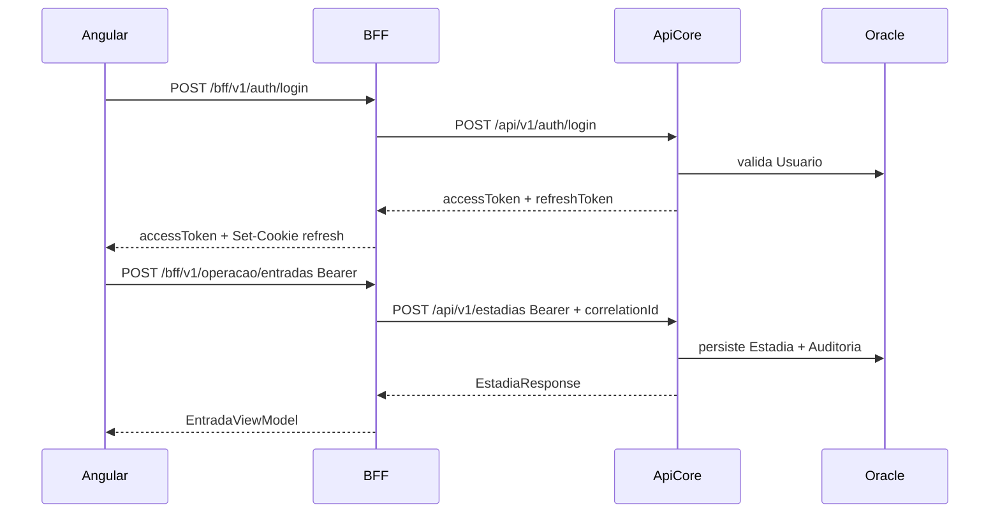
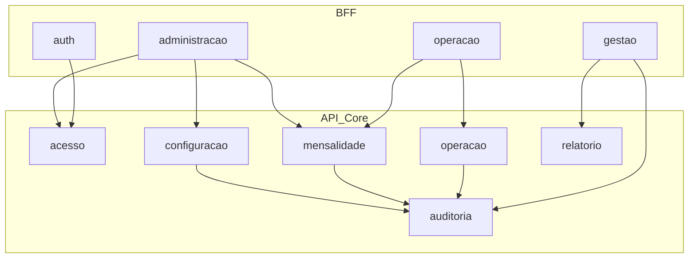

# Arquitetura da Solução — Green Park GP-Estacionamento

**Base:** [modelo_domínio_estacionamento_fcef6001.plan.md](.cursor/plans/modelo_domínio_estacionamento_fcef6001.plan.md) · [documento_requisitos_gp-estacionamento_a851089c.plan.md](.cursor/plans/documento_requisitos_gp-estacionamento_a851089c.plan.md)  
**Stack:** Angular | BFF Spring Boot | API Core Spring Boot | Oracle | Docker  
**Entregável (após aprovação):** `docs/ARQUITETURA-GP-ESTACIONAMENTO.md` — **sem código**

---

## 1. Visão geral



| Camada | Artefato | Porta (Compose) | Papel |
| --- | --- | --- | --- |
| UI | `gp-web` (Angular) | 4200 / nginx 80 | Experiência operador/admin |
| BFF | `gp-bff` | 8081 | Auth de borda, agregação de telas, adaptação de contrato UI |
| Core | `gp-api-core` | 8080 | Domínio, regras, persistência, auditoria |
| Dados | Oracle XE/Free | 1521 | Persistência única |

**Princípio (RNF15/RNF16):** regras de cobrança, estados de `Estadia`, planos e invariantes DDD residem **somente** na API Core. O BFF não recalcula tarifa nem altera agregados.

---

## 2. Responsabilidades por camada

### 2.1 Frontend Angular (`gp-web`)

- Telas e fluxos UC01–UC22 (entrada/saída priorizados — RNF11).
- Estado de UI, formulários, normalização visual de placa (RNF14).
- Guardas de rota por perfil (espelho de UX; autorização real no backend — RNF08).
- Consome **apenas** o BFF (`/bff/v1/**`); nunca chama a API Core diretamente.
- Tratamento de erros amigáveis (RNF13) a partir do envelope do BFF.
- Sem lógica de negócio de cobrança.

### 2.2 BFF Spring Boot (`gp-bff`)

- **Auth de borda:** login/logout/refresh; emissão de cookie `HttpOnly` de refresh (browser); validação do access token nas rotas.
- **Roteamento:** traduz endpoints orientados a tela → uma ou mais chamadas à Core.
- **Agregação:** monta DTOs de dashboard/pátio/comprovante combinando recursos da Core (ex.: ocupação + alertas de plano).
- **Adaptação:** nomes/campos amigáveis à UI; formatação de datas/valores para exibição quando necessário (valores canônicos vêm da Core).
- **Propagação:** `Authorization`, `X-Correlation-Id`, identidade do operador.
- **Não faz:** cálculo de tarifa, mudança de estado de agregados, SQL, regras RN*.

### 2.3 API Core Spring Boot (`gp-api-core`)

- Implementação dos agregados e serviços de domínio (seção 8 do modelo).
- Casos de uso transacionais (entrada, pagamento+saída atômicos — RNF04).
- Autorização por perfil em **todo** endpoint (RNF08).
- Persistência Oracle (JPA/JDBC); Optimistic Locking em `Estadia.versao`.
- Auditoria append-only (`RegistroAuditoria` — RF50/RNF21).
- Contrato REST canônico versionado `/api/v1` (RNF20).
- Health (`/actuator/health`) — RNF23.

### 2.4 Oracle

- Fonte da verdade de dados.
- Constraints de unicidade alinhadas às invariantes (placa em estadia aberta, login único, etc.).
- Sem lógica de negócio em procedures no MVP (manter regras na Core).

### 2.5 Docker

- `docker-compose` sobe web + bff + api-core + oracle (+ opcional reverse proxy).
- Rede isolada local (RNF07); volumes para dados Oracle; healthchecks (RNF23).

---

## 3. Comunicação entre serviços

| Trecho | Protocolo | Formato | Auth | Notas |
| --- | --- | --- | --- | --- |
| Browser → BFF | HTTPS (prod) / HTTP (Compose local) | JSON | `Authorization: Bearer <access>` + cookie refresh | CORS restrito à origem do Angular |
| BFF → Core | HTTP na rede Docker | JSON | Mesmo Bearer (JWT assinado pela Core) | Timeout curto; retry só em GET idempotentes |
| Core → Oracle | JDBC | SQL | credencial de serviço | Pool HikariCP |

**Padrões obrigatórios:**

- **Síncrono REST** em todo o MVP (sem fila/mensagem — escopo portfólio, uma unidade).
- **Correlation ID:** cliente ou BFF gera `X-Correlation-Id` (UUID); BFF e Core propagam em logs e respostas de erro.
- **Idempotência operacional:** operações financeiras críticas (`POST` pagamento/encerramento) aceitam header `Idempotency-Key` na Core para evitar duplicidade por retry.
- **Relógio:** Core usa horário do servidor (RNF22); BFF/UI não usam clock local para cobrança.
- **Circuitos:** falha da Core → BFF retorna erro padronizado `502/503` sem inventar dados de domínio.



---

## 4. Contratos REST

### 4.1 Convenções globais

| Item | Decisão |
| --- | --- |
| Versionamento | Prefixo de path: Core `/api/v1`, BFF `/bff/v1` |
| Estilo | REST resource-oriented; verbos HTTP semânticos |
| Corpo | JSON UTF-8; datas ISO-8601; dinheiro decimal string ou number com 2 casas (contrato fixo: **number com 2 casas**, half-up na Core) |
| IDs | UUID string |
| Paginação | `page`, `size`, `sort` → resposta `{ content, page, size, totalElements, totalPages }` |
| Filtros | query params (`placa`, `status`, `dataInicio`, `dataFim`) |
| Sucesso | `200`/`201`/`204`; criação retorna recurso + `Location` quando aplicável |
| Erro | Problem Details (RFC 7807) — ver §9 |

### 4.2 API Core — mapa de recursos (canônico)

Organizado pelos contextos DDD.

**Acesso / Auth**

| Método | Path | Perfil | Responsabilidade |
| --- | --- | --- | --- |
| POST | `/api/v1/auth/login` | público | Autentica; retorna tokens + perfil |
| POST | `/api/v1/auth/refresh` | refresh válido | Novo access token |
| POST | `/api/v1/auth/logout` | autenticado | Invalida refresh (deny-list/versão) |
| GET | `/api/v1/auth/me` | autenticado | Usuário corrente |

**Usuários**

| Método | Path | Perfil |
| --- | --- | --- |
| GET/POST | `/api/v1/usuarios` | ADMIN |
| GET/PUT | `/api/v1/usuarios/{id}` | ADMIN |
| POST | `/api/v1/usuarios/{id}/bloqueio` | ADMIN |
| POST | `/api/v1/usuarios/{id}/desativacao` | ADMIN |

**Configuração**

| Método | Path | Perfil |
| --- | --- | --- |
| GET/PUT | `/api/v1/estacionamento` | GET: autenticado; PUT: ADMIN |
| GET | `/api/v1/politicas-tarifarias/vigente` | autenticado |
| PUT | `/api/v1/politicas-tarifarias/vigente` | ADMIN |
| GET | `/api/v1/politicas-tarifarias/historico` | ADMIN |
| GET/PUT | `/api/v1/parametros-operacionais` | GET: autenticado; PUT: ADMIN |
| CRUD | `/api/v1/veiculos-servico` | ADMIN |

**Operação / Estadia**

| Método | Path | Perfil | Nota |
| --- | --- | --- | --- |
| POST | `/api/v1/estadias` | OPERADOR+ | Entrada; gera ticket |
| GET | `/api/v1/estadias/{id}` | autenticado | |
| GET | `/api/v1/estadias?placa=&ticket=&status=` | autenticado | |
| GET | `/api/v1/patio` | autenticado | Lista abertas + ocupação |
| GET | `/api/v1/patio/ocupacao` | autenticado | Contadores |
| POST | `/api/v1/estadias/{id}/inicio-saida` | OPERADOR+ | → EM_COBRANCA + cálculo |
| POST | `/api/v1/estadias/{id}/cancelamento-saida` | OPERADOR+ | |
| PUT | `/api/v1/estadias/{id}/modalidade` | OPERADOR+ | Antes da quitação |
| POST | `/api/v1/estadias/{id}/perda-ticket` | OPERADOR+ | |
| PUT | `/api/v1/estadias/{id}/placa` | OPERADOR+ | Correção + auditoria |
| POST | `/api/v1/estadias/{id}/pagamentos` | OPERADOR+ | Idempotent |
| POST | `/api/v1/estadias/{id}/encerramento` | OPERADOR+ | Quitação/benefício/saída especial |
| POST | `/api/v1/estadias/{id}/saida-especial` | ADMIN | Cortesia/isenção/admin |
| POST | `/api/v1/pagamentos/{id}/estorno` | ADMIN | |
| GET | `/api/v1/estadias/{id}/comprovante` | autenticado | Dados RN24 |

**Mensalidade**

| Método | Path | Perfil |
| --- | --- | --- |
| CRUD | `/api/v1/titulares` | ADMIN |
| CRUD | `/api/v1/planos-mensais` | ADMIN |
| POST | `/api/v1/planos-mensais/{id}/veiculos` | ADMIN |
| DELETE/PUT | `/api/v1/planos-mensais/{id}/veiculos/{veiculoId}` | ADMIN |
| POST | `/api/v1/planos-mensais/{id}/renovacoes` | ADMIN |
| POST | `/api/v1/planos-mensais/{id}/suspensao` | ADMIN |
| POST | `/api/v1/planos-mensais/{id}/cancelamento` | ADMIN |
| POST | `/api/v1/planos-mensais/{id}/pagamentos` | ADMIN/OPERADOR conforme política |
| GET | `/api/v1/beneficios/placa/{placa}` | autenticado | Resolução mensalista/serviço |

**Relatórios / Auditoria / Dashboard**

| Método | Path | Perfil |
| --- | --- | --- |
| GET | `/api/v1/dashboard/resumo` | autenticado | |
| GET | `/api/v1/relatorios/{tipo}` | ADMIN | faturamento, ocupação, planos, isenções… |
| GET | `/api/v1/auditorias` | ADMIN | filtros por período/tipo/usuário |

**Infra**

- `GET /actuator/health`, `GET /actuator/info` (sem exposição sensível).

### 4.3 BFF — contratos orientados a tela

O BFF **espelha** fluxos de UI; internamente orquestra a Core.

| Área BFF | Exemplos de path | Agregação típica |
| --- | --- | --- |
| Auth | `POST /bff/v1/auth/login`, `refresh`, `logout`, `GET /bff/v1/auth/sessao` | Cookie refresh + access no body |
| Operação | `POST /bff/v1/operacao/entradas` | entrada + benefício da placa + ocupação pós-entrada |
| Operação | `GET /bff/v1/operacao/patio` | lista + ocupação + alertas |
| Operação | `POST /bff/v1/operacao/saidas/iniciar` | início saída + breakdown de cálculo |
| Operação | `POST /bff/v1/operacao/saidas/pagar-e-encerrar` | pagamento + encerramento (1 clique UI → N calls Core em transação lógica; Core mantém atomicidade por endpoint de encerramento) |
| Admin | `/bff/v1/admin/usuarios`, `tarifas`, `parametros`, `planos`, `titulares`, `veiculos-servico` | proxy fino + validação de shape UI |
| Gestão | `/bff/v1/dashboard`, `/bff/v1/relatorios/*`, `/bff/v1/auditorias` | adaptação de filtros de tela |

**Regra:** se a UI precisa de 1 chamada, o BFF pode fazer N GETs à Core; **comandos de escrita** que alteram dinheiro/estado devem preferir **um único comando** na Core (ex.: encerrar com pagamento) para preservar RNF04.

---

## 5. Módulos da API Core

Pacote base: `br.com.greenpark.estacionamento.core`

Alinhamento 1:1 com contextos DDD + camadas hexagonais leves.

```text
gp-api-core
└── br.com.greenpark.estacionamento.core
    ├── GpApiCoreApplication
    ├── compartilhado          # kernel: Resultado, exceptions, VOs compartilhados, clock
    ├── acesso                 # Usuario, autenticação JWT, autorização
    ├── configuracao           # Estacionamento, PoliticaTarifaria, Parametro, VeiculoServico
    ├── operacao               # Estadia, Pagamento, Patio, CalculadoraTarifa, Ocupacao
    ├── mensalidade            # Titular, PlanoMensal, ServicoIdentificacaoBeneficio
    ├── auditoria              # RegistroAuditoria (append-only)
    ├── relatorio              # consultas/read-models gerenciais
    └── infraestrutura         # JPA, security config, logging, advice, Oracle
```

**Por módulo de domínio (padrão interno):**

- `dominio` — agregados, VOs, enums, serviços de domínio, repositórios (ports)
- `aplicacao` — casos de uso / application services / comandos-consultas
- `api` — controllers REST, request/response DTOs, mappers
- `infra` — adapters JPA, queries nativas se necessário

| Módulo | Agregados / serviços | RF principais |
| --- | --- | --- |
| `acesso` | Usuario, emissão/validação JWT | RF01–RF05 |
| `configuracao` | Estacionamento, PoliticaTarifaria, ParametroOperacional, VeiculoServico | RF06–RF10, RF42 |
| `operacao` | Estadia (+ pagamentos/estornos/eventos), CalculadoraTarifa, ServicoOcupacaoPatio | RF11–RF29, RF39–RF41 |
| `mensalidade` | Titular, PlanoMensal, ServicoIdentificacaoBeneficio | RF30–RF38 |
| `auditoria` | RegistroAuditoria | RF50 |
| `relatorio` | read models (sem mutação) | RF43–RF49 |
| `compartilhado` | Placa, ValorMonetario, Problema, correlation | transversal |
| `infraestrutura` | Security, JPA, Actuator | RNF* |

**Fase 2 (fora do MVP de módulos ativos):** `caixa` (TurnoCaixa / RN18) — pasta reservada, não exposta.

---

## 6. Módulos do BFF

Pacote base: `br.com.greenpark.estacionamento.bff`

```text
gp-bff
└── br.com.greenpark.estacionamento.bff
    ├── GpBffApplication
    ├── auth                   # login/refresh/logout/sessão + cookies
    ├── operacao               # entradas, pátio, saídas, pagamentos (visão operador)
    ├── administracao          # usuários, tarifas, parâmetros, planos, titulares, serviço
    ├── gestao                 # dashboard, relatórios, auditoria (visão agregada)
    ├── cliente.core           # WebClient/RestClient tipado para API Core
    ├── seguranca              # filtros JWT, CORS, CSRF strategy
    └── compartilhado          # envelope erro UI, correlation, config
```

| Módulo BFF | Chama Core | Objetivo UI |
| --- | --- | --- |
| `auth` | `/api/v1/auth/**` | UC01, UC22 |
| `operacao` | estadias, pátio, benefícios, comprovante | UC05–UC10, UC14–UC18 |
| `administracao` | usuarios, config, planos, titulares, veiculos-servico | UC02–UC04, UC11–UC13, UC16 |
| `gestao` | dashboard, relatorios, auditorias | UC19–UC21 |
| `cliente.core` | todos | resiliência, headers, mapping HTTP |

---

## 7. Estrutura de pastas dos projetos (monorepo)

```text
GreenParkGP-Estacionamento/
├── docs/
│   ├── REQUISITOS-GP-ESTACIONAMENTO.md
│   ├── MODELO-DOMINIO-GP-ESTACIONAMENTO.md
│   └── ARQUITETURA-GP-ESTACIONAMENTO.md    # este documento
├── apps/
│   ├── gp-web/                            # Angular
│   │   ├── src/app/
│   │   │   ├── core/                      # auth interceptors, guards, services HTTP BFF
│   │   │   ├── shared/                    # UI compartilhada
│   │   │   ├── features/
│   │   │   │   ├── auth/
│   │   │   │   ├── operacao/              # entrada, pátio, saída
│   │   │   │   ├── administracao/
│   │   │   │   ├── planos/
│   │   │   │   ├── dashboard/
│   │   │   │   └── relatorios/
│   │   │   ├── layout/
│   │   │   └── environments/
│   │   ├── Dockerfile
│   │   └── nginx.conf
│   ├── gp-bff/                            # Spring Boot Maven
│   │   ├── src/main/java/.../bff/
│   │   ├── src/main/resources/
│   │   │   ├── application.yml
│   │   │   └── application-docker.yml
│   │   ├── Dockerfile
│   │   └── pom.xml
│   └── gp-api-core/                       # Spring Boot Maven
│       ├── src/main/java/.../core/
│       ├── src/main/resources/
│       │   ├── application.yml
│       │   ├── application-docker.yml
│       │   └── db/migration/              # Flyway (versão schema)
│       ├── Dockerfile
│       └── pom.xml
├── infra/
│   ├── oracle/                            # init scripts (sem lógica de negócio)
│   └── proxy/                             # opcional nginx/traefik
├── docker-compose.yml
├── .env.example
└── README.md
```

**Frontend feature folders** mapeiam UCs; comunicação só via `core/services` → BFF.

---

## 8. Estratégia de autenticação

### 8.1 Modelo

- **Fonte da verdade de credenciais:** API Core (agregado `Usuario`; senha com hash forte — BCrypt/Argon2 — RNF06).
- **Emissor JWT:** API Core (HMAC ou RSA; chave só no Core; BFF apenas valida com chave pública/secreto compartilhado de validação).
- **Perfis no token:** `perfil` = `OPERADOR` | `ADMINISTRADOR`; `sub` = userId; `login`; `jti`.
- **Access token:** curta duração (ex.: 15 min), enviado no header `Authorization` pelo Angular.
- **Refresh token:** opaco ou JWT de longa duração (ex.: 8h turno); BFF seta cookie `HttpOnly`, `Secure` (prod), `SameSite=Strict`; path `/bff/v1/auth`.
- **Logout:** Core invalida refresh (versão de token / tabela de refresh); BFF limpa cookie.
- **Inatividade (RF02):** frontend timer + expiração do access; refresh só se dentro da janela; senão exige novo login.

### 8.2 Autorização

- Spring Security method/HTTP security na **Core** e no **BFF** (BFF evita expor rotas admin ao perfil errado cedo; Core é a barreira definitiva — RNF08/RNF09).
- Matriz resumida:
  - OPERADOR: operação de pátio, consulta config vigente, consulta benefício, pagamento estadia.
  - ADMINISTRADOR: tudo do operador + usuários, tarifas, parâmetros, planos, estorno, saída especial, relatórios, auditoria.

### 8.3 Rede

- Em Compose: Core **não** publica porta ao host em produção documentada; só BFF (e web) expostos — reforça RNF09.
- Em dev local, Core pode expor 8080 para testes com Postman, documentado como exceção.

---

## 9. Estratégia de logs

| Tipo | Onde | Formato | Conteúdo |
| --- | --- | --- | --- |
| Aplicação | BFF + Core | JSON estruturado (stdout → Docker) | timestamp, level, service, correlationId, userId, path, message |
| Acesso HTTP | BFF + Core | JSON | method, path, status, latencyMs (sem body sensível) |
| Auditoria de negócio | Core → Oracle `RegistroAuditoria` | persistido | RF50 — separado de log técnico |
| Erros | BFF + Core | JSON + stack só em log (não no response prod) | exception type, message sanitizada |

**Regras (RNF10/RNF24):**

- Nunca logar senha, hash, refresh token completo, dados de cartão.
- Placa **pode** aparecer em log operacional.
- Mascarar documento (CPF/CNPJ) parcialmente em logs técnicos.
- Níveis: `INFO` fluxo; `WARN` regra de negócio rejeitada esperada; `ERROR` falha inesperada; `DEBUG` só em não-prod.
- Retention: stdout coletável; auditoria de negócio retida no Oracle conforme política de portfólio.

---

## 10. Estratégia de tratamento de erros

### 10.1 Classificação na Core

| Tipo | Origem | HTTP | `type` (exemplo) |
| --- | --- | --- | --- |
| Validação de entrada | Bean Validation / VO | 400 | `validacao` |
| Regra de negócio | invariante DDD (placa duplicada, lotado, etc.) | 422 | `regra-negocio` |
| Não autenticado | security | 401 | `nao-autenticado` |
| Não autorizado | perfil | 403 | `nao-autorizado` |
| Não encontrado | id inexistente | 404 | `nao-encontrado` |
| Conflito / concorrência | versão Estadia | 409 | `conflito` |
| Erro inesperado | bug/infra | 500 | `erro-interno` |

### 10.2 Contrato de erro (RFC 7807)

Campos: `type`, `title`, `status`, `detail` (pt-BR — RNF13), `instance`, `correlationId`, `codigo` (ex.: `ESTADIA_PLACA_DUPLICADA`), `erros[]` (campos, quando validação).

### 10.3 Propagação BFF → UI

- BFF **repassa** `codigo`, `detail` e `correlationId` da Core quando a falha é de domínio.
- Falhas de rede/timeout BFF→Core viram `503` com mensagem clara (“serviço temporariamente indisponível”).
- Angular exibe `detail` ao usuário; `correlationId` em modo suporte/admin.

### 10.4 Transações

- Pagamento + encerramento: um caso de uso / uma transação na Core; falha → rollback total (RNF04).
- Estorno: nova transação vinculada; não apaga pagamento original.

---

## 11. Cross-cutting e operação

- **Observabilidade:** Actuator health; logs JSON; correlationId ponta a ponta.
- **Migrações:** Flyway na Core (schema versionado); sem SQL solto no Compose além de init Oracle.
- **Config:** `application.yml` + env vars (`ORACLE_*`, `JWT_SECRET`, `CORE_BASE_URL`).
- **Docker Compose services:** `oracle`, `gp-api-core`, `gp-bff`, `gp-web`.
- **Performance (RNF01/RNF02):** índices Oracle em placa/status estadia, ticket, vigência plano; consultas de pátio paginadas/limitadas.

---

## 12. Mapeamento domínio → módulos (resumo)



---

## 13. Entregável desta etapa

Persistir o conteúdo deste plano como **`docs/ARQUITETURA-GP-ESTACIONAMENTO.md`** após aprovação.

**Não gerar código**, SQL de domínio, nem scaffolding de projetos nesta etapa.
