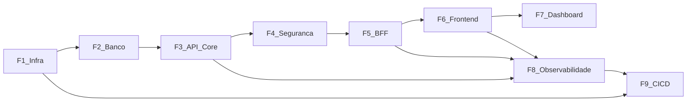

# Backlog de Implementação Incremental — GP-Estacionamento

**Base:** [arquitetura_enterprise_gp_95bc27ba.plan.md](.cursor/plans/arquitetura_enterprise_gp_95bc27ba.plan.md) · [modelo_domínio_estacionamento_fcef6001.plan.md](.cursor/plans/modelo_domínio_estacionamento_fcef6001.plan.md)  
**Princípio:** cada etapa entrega valor verificável; regras de negócio só na API Core; BFF não calcula tarifa.

**Convenção de IDs:** `F{fase}.{ordem}` (prioridade crescente dentro da fase).  
**Fora do MVP:** módulo `caixa` / `TurnoCaixa` (RN18) — pasta reservada, sem endpoints.

---

## Fase 1 — Infraestrutura

### F1.1 — Monorepo e esqueleto de projetos ✅

| Campo | Conteúdo |
| --- | --- |
| **Objetivo** | Criar estrutura `apps/gp-api-core`, `apps/gp-bff`, `apps/gp-web`, `infra/`, `docs/` conforme §7 da arquitetura |
| **Dependências** | Nenhuma |
| **Critérios de aceite** | Três projetos compilam/bootstrappam (Spring Boot vazio + Angular scaffold); `README.md` com como subir; `.env.example` com `ORACLE_*`, `JWT_SECRET`, `CORE_BASE_URL` |
| **Entidades** | — |
| **Endpoints** | — (só health placeholder se gerado pelo Spring) |
| **Testes** | Smoke: `mvn -q -DskipTests package` nos dois backends; `ng build` no web |
| **Status** | Concluída — smoke `mvn package` (Core/BFF) e `ng build` (Web) OK |

### F1.2 — Docker Compose base (Oracle + health)

| Campo | Conteúdo |
| --- | --- |
| **Objetivo** | `docker-compose.yml` com serviço `oracle` (XE/Free), rede isolada, volume persistente, healthcheck |
| **Dependências** | F1.1 |
| **Critérios de aceite** | `docker compose up oracle` fica healthy; porta 1521 acessível em dev; init scripts em `infra/oracle/` criam usuário/schema vazio |
| **Entidades** | — |
| **Endpoints** | — |
| **Testes** | Script/CI local verifica `healthcheck` = healthy em ≤ N minutos |

### F1.3 — Dockerfiles e Compose multi-serviço

| Campo | Conteúdo |
| --- | --- |
| **Objetivo** | Empacotar `gp-api-core`, `gp-bff`, `gp-web` (nginx) e orquestrar no Compose |
| **Dependências** | F1.1, F1.2 |
| **Critérios de aceite** | `docker compose up` sobe 4 serviços; Core 8080 (dev), BFF 8081, Web 80/4200; Core não precisa ser público em perfil prod documentado |
| **Entidades** | — |
| **Endpoints** | `GET /actuator/health` (Core e BFF) |
| **Testes** | Compose smoke: health 200 em Core e BFF após start |

---

## Fase 2 — Banco de Dados

### F2.1 — Flyway + schema kernel

| Campo | Conteúdo |
| --- | --- |
| **Objetivo** | Configurar Flyway na Core; migration V1 com tabelas de suporte (`flyway_schema_history` implícito) e tipos/constraints base |
| **Dependências** | F1.2, F1.3 (Core conecta ao Oracle) |
| **Critérios de aceite** | App sobe e aplica migrations; falha se schema divergir; sem procedures de negócio |
| **Entidades** | — (infra) |
| **Endpoints** | — |
| **Testes** | Teste de integração: Flyway migrate em container Oracle (Testcontainers ou Compose) |

### F2.2 — Tabelas Acesso + Configuração

| Campo | Conteúdo |
| --- | --- |
| **Objetivo** | Persistência de `Usuario`, `Estacionamento`, `PoliticaTarifaria` (+ itens/histórico), `ParametroOperacional`, `VeiculoServico` |
| **Dependências** | F2.1 |
| **Critérios de aceite** | UK em `Usuario.login`; FK/constraints alinhadas ao modelo; seed mínimo (1 admin, 1 política vigente, capacidade, parâmetros default) |
| **Entidades** | Usuario, Estacionamento, PoliticaTarifaria, ItemTarifaHoraria, HistoricoAlteracaoTarifa, ParametroOperacional, VeiculoServico |
| **Endpoints** | — |
| **Testes** | Migration idempotente; constraints rejeitam login duplicado |

### F2.3 — Tabelas Operação + Mensalidade + Auditoria

| Campo | Conteúdo |
| --- | --- |
| **Objetivo** | Schema completo de pátio, planos e auditoria append-only |
| **Dependências** | F2.2 |
| **Critérios de aceite** | Índice/UK: no máximo uma estadia aberta por placa; ticket único; placa em no máximo um plano ativo; `RegistroAuditoria` sem UPDATE/DELETE de app; `Estadia.versao` para optimistic lock |
| **Entidades** | Estadia, PagamentoEstadia, EstornoPagamento, EventoEstadia, Titular, PlanoMensal, VeiculoPlano, PeriodoPlano, PagamentoPlano, RegistroAuditoria |
| **Endpoints** | — |
| **Testes** | Testes de constraint (placa duplicada no pátio; ticket duplicado) |

---

## Fase 3 — API Core

Ordem interna: kernel → configuração → usuários (CRUD) → operação avulsa → mensalidade → auditoria/consulta → relatórios base. Auth JWT pleno fica na Fase 4; nesta fase endpoints protegidos por filtro stub ou security desligada em perfil `test`/`local` documentado, **exceto** que contratos REST canônicos `/api/v1` já existem.

### F3.1 — Kernel compartilhado e erros RFC 7807

| Campo | Conteúdo |
| --- | --- |
| **Objetivo** | Pacote `compartilhado`: VOs (`Placa`, `ValorMonetario`), clock de servidor, `ProblemDetail`, correlationId, advice global |
| **Dependências** | F2.1 |
| **Critérios de aceite** | Erros 400/422/404/409/500 no contrato §10; `X-Correlation-Id` ecoado; datas ISO-8601; dinheiro 2 casas half-up |
| **Entidades** | VOs compartilhados |
| **Endpoints** | Endpoint de teste interno ou validação via controllers seguintes |
| **Testes** | Unit: Placa (Mercosul/antiga); ValorMonetario; Teste MVC do advice |

### F3.2 — Módulo Configuração

| Campo | Conteúdo |
| --- | --- |
| **Objetivo** | CRUD/consulta de unidade, tarifas vigentes, parâmetros e veículos de serviço |
| **Dependências** | F2.2, F3.1 |
| **Critérios de aceite** | Alteração de tarifa gera histórico e não recalcula estadias encerradas; GET vigente sempre retorna política ativa |
| **Entidades** | Estacionamento, PoliticaTarifaria (+ itens/histórico), ParametroOperacional, VeiculoServico |
| **Endpoints** | `GET/PUT /api/v1/estacionamento`; `GET/PUT /api/v1/politicas-tarifarias/vigente`; `GET /api/v1/politicas-tarifarias/historico`; `GET/PUT /api/v1/parametros-operacionais`; CRUD `/api/v1/veiculos-servico` |
| **Testes** | Integração: PUT tarifa → histórico; GET vigente; validação de tabela 1–7h |

### F3.3 — Módulo Acesso (usuários, sem JWT final)

| Campo | Conteúdo |
| --- | --- |
| **Objetivo** | Gerenciar usuários (criar, listar, bloquear, desativar); hash BCrypt; login retorna payload provisório até F4 |
| **Dependências** | F2.2, F3.1 |
| **Critérios de aceite** | Não exclui usuário (soft: bloqueio/desativação); login único; senha nunca em claro/logs |
| **Entidades** | Usuario |
| **Endpoints** | `GET/POST /api/v1/usuarios`; `GET/PUT /api/v1/usuarios/{id}`; `POST .../bloqueio`; `POST .../desativacao`; stub `POST /api/v1/auth/login` (corpo válido; tokens finais em F4) |
| **Testes** | Unit/integração: hash; bloqueio impede login; login inválido 401 |

### F3.4 — Operação: entrada, pátio e consulta

| Campo | Conteúdo |
| --- | --- |
| **Objetivo** | Abrir estadia, gerar ticket, listar pátio/ocupação, consultar por placa/ticket (UC05–UC07) |
| **Dependências** | F2.3, F3.2, F3.3 |
| **Critérios de aceite** | Placa única no pátio (422); lotação bloqueia avulso conforme parâmetro; ticket único; relógio do servidor; EventoEstadia ENTRADA |
| **Entidades** | Estadia, EventoEstadia, Estacionamento, ParametroOperacional |
| **Endpoints** | `POST /api/v1/estadias`; `GET /api/v1/estadias/{id}`; `GET /api/v1/estadias?placa=&ticket=&status=`; `GET /api/v1/patio`; `GET /api/v1/patio/ocupacao` |
| **Testes** | Integração: entrada ok; duplicata; lotado; ocupação coerente |

### F3.5 — Operação: CalculadoraTarifa + início/cancelamento de saída

| Campo | Conteúdo |
| --- | --- |
| **Objetivo** | Transicionar `ABERTA` → `EM_COBRANCA`, calcular horária/diária/melhor preço, cancelar saída |
| **Dependências** | F3.4, F3.2 |
| **Critérios de aceite** | Cálculo só na Core; freeze de valores no momento do cálculo; melhor preço quando parâmetro ativo; cancelamento volta a `ABERTA` sem pagamento |
| **Entidades** | Estadia, PoliticaTarifaria, ParametroOperacional |
| **Endpoints** | `POST /api/v1/estadias/{id}/inicio-saida`; `POST .../cancelamento-saida`; `PUT .../modalidade` |
| **Testes** | Unit massivos da CalculadoraTarifa (1–7h, excedente, diária, RN08); integração máquina de estados |

### F3.6 — Operação: pagamento, encerramento, comprovante

| Campo | Conteúdo |
| --- | --- |
| **Objetivo** | Quitação atômica + encerramento (RNF04); idempotência; comprovante RN24 |
| **Dependências** | F3.5 |
| **Critérios de aceite** | Pagamento+encerramento em 1 transação (ou encerramento que exige quitação); header `Idempotency-Key` evita duplicar pagamento; optimistic lock 409; status finais corretos |
| **Entidades** | Estadia, PagamentoEstadia |
| **Endpoints** | `POST /api/v1/estadias/{id}/pagamentos`; `POST .../encerramento`; `GET .../comprovante` |
| **Testes** | Integração transacional (rollback); idempotência; concorrência de versão |

### F3.7 — Operação: perda de ticket, correção de placa, saída especial, estorno

| Campo | Conteúdo |
| --- | --- |
| **Objetivo** | Completar fluxos UC auxiliares de pátio (RF39–RF41, RN12, RN19, RN22) |
| **Dependências** | F3.6 |
| **Critérios de aceite** | Taxa perda aplicada; correção de placa audita evento; saída especial só perfil admin (enforce em F4); estorno cria registro vinculado sem apagar pagamento |
| **Entidades** | Estadia, PagamentoEstadia, EstornoPagamento, EventoEstadia |
| **Endpoints** | `POST .../perda-ticket`; `PUT .../placa`; `POST .../saida-especial`; `POST /api/v1/pagamentos/{id}/estorno` |
| **Testes** | Integração por cenário; motivo obrigatório onde RN22 exige |

### F3.8 — Mensalidade + benefício por placa

| Campo | Conteúdo |
| --- | --- |
| **Objetivo** | Titulares, planos, veículos, renovação/suspensão/cancelamento/pagamento; resolução de benefício na entrada |
| **Dependências** | F2.3, F3.4 |
| **Critérios de aceite** | Placa em no máximo um plano ativo; benefício só com período vigente/carência; entrada classifica mensalista/serviço |
| **Entidades** | Titular, PlanoMensal, VeiculoPlano, PeriodoPlano, PagamentoPlano, VeiculoServico, Estadia |
| **Endpoints** | CRUD `/api/v1/titulares`; CRUD `/api/v1/planos-mensais`; `POST/DELETE/PUT .../veiculos`; `POST .../renovacoes|suspensao|cancelamento|pagamentos`; `GET /api/v1/beneficios/placa/{placa}` |
| **Testes** | Integração RN13–RN16; entrada mensalista não cobra / modalidade MENSAL |

### F3.9 — Auditoria de negócio + relatórios base

| Campo | Conteúdo |
| --- | --- |
| **Objetivo** | Persistência append-only de operações críticas; endpoints de consulta e relatórios mínimos |
| **Dependências** | F3.4–F3.8 |
| **Critérios de aceite** | Operações críticas geram `RegistroAuditoria`; API de listagem filtrável; relatórios faturamento/ocupação/planos/isenções retornam agregados sem mutar |
| **Entidades** | RegistroAuditoria (+ read models) |
| **Endpoints** | `GET /api/v1/auditorias`; `GET /api/v1/relatorios/{tipo}`; `GET /api/v1/dashboard/resumo` (payload canônico; UI rica na F7) |
| **Testes** | Integração: entrada/pagamento/tarifa geram auditoria; relatório bate com fixtures |

---

## Fase 4 — Segurança

### F4.1 — JWT na Core (emissor)

| Campo | Conteúdo |
| --- | --- |
| **Objetivo** | Access JWT (15 min) + refresh (versão/deny-list); claims `sub`, `login`, `perfil`, `jti` |
| **Dependências** | F3.3 |
| **Critérios de aceite** | Login/refresh/logout/me funcionais; senha com hash forte; refresh invalidado no logout; chave só na Core |
| **Entidades** | Usuario (+ store de refresh) |
| **Endpoints** | `POST /api/v1/auth/login|refresh|logout`; `GET /api/v1/auth/me` |
| **Testes** | Segurança: token expirado 401; refresh rotaciona/invalida; logout impede reuse |

### F4.2 — Autorização por perfil em todos os endpoints

| Campo | Conteúdo |
| --- | --- |
| **Objetivo** | Matriz OPERADOR vs ADMINISTRADOR (RNF08/RNF09) na Core |
| **Dependências** | F4.1, F3.* |
| **Critérios de aceite** | Operador acessa operação/consultas; Admin acessa usuários, tarifas, estorno, saída especial, relatórios, auditoria; 403 com Problem Details |
| **Entidades** | Usuario |
| **Endpoints** | Todos `/api/v1/**` (revisão de security filter + method security) |
| **Testes** | `@WithMockUser` / testes de filtro por endpoint crítico (matriz mínima automatizada) |

### F4.3 — Hardening (CORS Core interno, secrets, exposição)

| Campo | Conteúdo |
| --- | --- |
| **Objetivo** | Core só rede Docker em perfil prod; secrets via env; sem dados sensíveis em logs |
| **Dependências** | F1.3, F4.1 |
| **Critérios de aceite** | Documentação + Compose perfil prod sem publicar 8080; `JWT_SECRET` obrigatório; testes de log não contém senha/token |
| **Entidades** | — |
| **Endpoints** | Actuator limitado (`health`, `info`) |
| **Testes** | Teste de configuração de perfil; checklist automatizado de Actuator |

---

## Fase 5 — BFF

### F5.1 — Cliente Core + auth de borda (cookies)

| Campo | Conteúdo |
| --- | --- |
| **Objetivo** | `RestClient`/`WebClient` tipado; login/refresh/logout/sessão; refresh em cookie HttpOnly |
| **Dependências** | F4.1, F1.3 |
| **Critérios de aceite** | UI recebe access no body; refresh só cookie `SameSite=Strict`; propaga Bearer + `X-Correlation-Id`; timeout → 503 padronizado |
| **Entidades** | — (adaptação de Usuario/sessão) |
| **Endpoints** | `POST /bff/v1/auth/login|refresh|logout`; `GET /bff/v1/auth/sessao` |
| **Testes** | WireMock/MockWebServer Core; cookie set/clear; propagação correlationId |

### F5.2 — BFF Operação (telas UC05–UC10)

| Campo | Conteúdo |
| --- | --- |
| **Objetivo** | Endpoints orientados a tela: entrada, pátio, iniciar saída, pagar-e-encerrar |
| **Dependências** | F5.1, F3.4–F3.6 |
| **Critérios de aceite** | Escrita crítica preferencialmente 1 comando Core; agregação só em GETs; sem recálculo de tarifa no BFF |
| **Entidades** | ViewModels de Estadia/Pátio/Comprovante |
| **Endpoints** | `POST /bff/v1/operacao/entradas`; `GET /bff/v1/operacao/patio`; `POST /bff/v1/operacao/saidas/iniciar`; `POST /bff/v1/operacao/saidas/pagar-e-encerrar` (+ proxies finos de consulta/comprovante) |
| **Testes** | Contrato BFF; verificação de que BFF não contém CalculadoraTarifa |

### F5.3 — BFF Administração + Gestão

| Campo | Conteúdo |
| --- | --- |
| **Objetivo** | Proxy/adaptação admin (usuários, tarifas, parâmetros, planos, titulares, serviço) e gestão (dashboard/relatórios/auditorias) |
| **Dependências** | F5.1, F3.2, F3.8, F3.9, F4.2 |
| **Critérios de aceite** | Rotas admin bloqueadas cedo no BFF para OPERADOR; erros de domínio repassam `codigo`/`detail`/`correlationId` |
| **Entidades** | DTOs de tela admin/gestão |
| **Endpoints** | `/bff/v1/admin/**`; `/bff/v1/dashboard`; `/bff/v1/relatorios/*`; `/bff/v1/auditorias` |
| **Testes** | 403 operador em admin; mapeamento de erro Core→UI |

---

## Fase 6 — Frontend

### F6.1 — Shell Angular + auth + core HTTP

| Campo | Conteúdo |
| --- | --- |
| **Objetivo** | App shell, interceptors (Bearer, correlationId), guards de perfil, login/logout, timer de inatividade (RF02) |
| **Dependências** | F5.1 |
| **Critérios de aceite** | Consome só `/bff/v1/**`; refresh transparente; sessão expirada → login; erros amigáveis (RNF13) |
| **Entidades** | — (modelos TS espelhando ViewModels) |
| **Endpoints** | Auth BFF |
| **Testes** | Unit guards/interceptors; e2e login feliz/falha |

### F6.2 — Feature Operação (prioridade RNF11)

| Campo | Conteúdo |
| --- | --- |
| **Objetivo** | Telas entrada, pátio/ocupação, saída/pagamento/comprovante com mínimo de cliques |
| **Dependências** | F6.1, F5.2 |
| **Critérios de aceite** | Fluxo UC05→UC09 demonstrável; placa normalizada na UI (RNF14); responsivo desktop (RNF12) |
| **Entidades** | Estadia (visão UI) |
| **Endpoints** | Operação BFF |
| **Testes** | Component/e2e do fluxo feliz entrada→saída |

### F6.3 — Feature Administração + Planos

| Campo | Conteúdo |
| --- | --- |
| **Objetivo** | Telas UC02–UC04, UC11–UC13, veículos de serviço, titulares/planos |
| **Dependências** | F6.1, F5.3 |
| **Critérios de aceite** | Só ADMIN acessa rotas; formulários validam shape; sem lógica de cobrança no front |
| **Entidades** | Usuario, PoliticaTarifaria, ParametroOperacional, Titular, PlanoMensal, VeiculoServico |
| **Endpoints** | Admin BFF |
| **Testes** | Guard admin; testes de formulário críticos |

---

## Fase 7 — Dashboard

### F7.1 — Dashboard operacional (UC19)

| Campo | Conteúdo |
| --- | --- |
| **Objetivo** | Tela de resumo: ocupação, estadias abertas/longas, alertas de plano a vencer |
| **Dependências** | F3.9, F5.3, F6.1 |
| **Critérios de aceite** | Uma chamada BFF agrega dados Core; atualização manual/polling simples; sem inventar métricas no BFF se Core falhar |
| **Entidades** | Read model dashboard (ocupação, alertas) |
| **Endpoints** | `GET /bff/v1/dashboard` → `GET /api/v1/dashboard/resumo` (+ GETs auxiliares se agregação) |
| **Testes** | Integração BFF agregação; e2e smoke dashboard autenticado |

### F7.2 — Relatórios e auditoria UI (UC20–UC21)

| Campo | Conteúdo |
| --- | --- |
| **Objetivo** | Telas de relatórios por tipo e consulta de auditoria com filtros |
| **Dependências** | F7.1, F3.9, F5.3 |
| **Critérios de aceite** | Filtros período/tipo/usuário; exportação mínima (CSV ou print) se já prevista no SRS; somente ADMIN |
| **Entidades** | RegistroAuditoria, read models de relatório |
| **Endpoints** | `/bff/v1/relatorios/*`, `/bff/v1/auditorias` |
| **Testes** | E2E filtro + listagem; 403 operador |

---

## Fase 8 — Observabilidade

### F8.1 — Logs JSON estruturados ponta a ponta

| Campo | Conteúdo |
| --- | --- |
| **Objetivo** | Logging JSON (BFF+Core): service, correlationId, userId, path, latency; sem segredos (RNF10/RNF24) |
| **Dependências** | F5.1, F4.1 |
| **Critérios de aceite** | Mesmo `X-Correlation-Id` aparece do BFF à Core; documento/placa mascarados conforme regra; níveis INFO/WARN/ERROR corretos |
| **Entidades** | — |
| **Endpoints** | Transversal |
| **Testes** | Teste de appender/captura: login não loga senha; correlation presente |

### F8.2 — Health, readiness e métricas mínimas

| Campo | Conteúdo |
| --- | --- |
| **Objetivo** | Actuator health com dependência Oracle; info de versão; latência HTTP em log de acesso |
| **Dependências** | F1.3, F2.1 |
| **Critérios de aceite** | Health DOWN se Oracle indisponível; Compose healthchecks usam esses endpoints; sem expor env sensível |
| **Entidades** | — |
| **Endpoints** | `GET /actuator/health`, `GET /actuator/info` |
| **Testes** | Teste com Oracle parado → health DOWN |

---

## Fase 9 — CI/CD

### F9.1 — Pipeline CI (build + testes)

| Campo | Conteúdo |
| --- | --- |
| **Objetivo** | Pipeline (GitHub Actions ou equivalente) builda Core, BFF, Web; roda unitários; sobe Oracle para integração |
| **Dependências** | F1.*, testes das fases 3–6 |
| **Critérios de aceite** | PR bloqueia merge se build/teste falhar; cache Maven/npm; artefatos versionados |
| **Entidades** | — |
| **Endpoints** | — |
| **Testes** | O próprio pipeline é a verificação |

### F9.2 — CD Compose / ambiente demonstração

| Campo | Conteúdo |
| --- | --- |
| **Objetivo** | Job de publish imagens + script/`compose` de deploy demonstração; tag por commit/semver |
| **Dependências** | F9.1, F1.3 |
| **Critérios de aceite** | Uma tag gera imagens `gp-api-core`, `gp-bff`, `gp-web`; README descreve promote para demo; secrets só via CI vars |
| **Entidades** | — |
| **Endpoints** | Smoke pós-deploy: health + login |
| **Testes** | Smoke automatizado pós-deploy |

---

## Ordem de entrega demonstrável (marcos)

| Marco | Itens | Valor |
| --- | --- | --- |
| M1 — Skeleton rodando | F1.1–F1.3, F2.1 | Compose + health |
| M2 — Domínio avulso API | F2.2–F2.3, F3.1–F3.6 | Entrada→pagamento via Postman |
| M3 — Domínio completo API | F3.7–F3.9, F4.* | Planos + segurança |
| M4 — Stack vertical operador | F5.1–F5.2, F6.1–F6.2 | UI entrada/saída |
| M5 — Admin + gestão | F5.3, F6.3, F7.* | Produto completo MVP |
| M6 — Operação de software | F8.*, F9.* | Observabilidade + CI/CD |

---

## Fora de escopo deste backlog

- `TurnoCaixa` / sangria (RN18)
- Filas/mensageria
- Multi-unidade / multi-tenant
- Lógica de negócio em procedures Oracle
