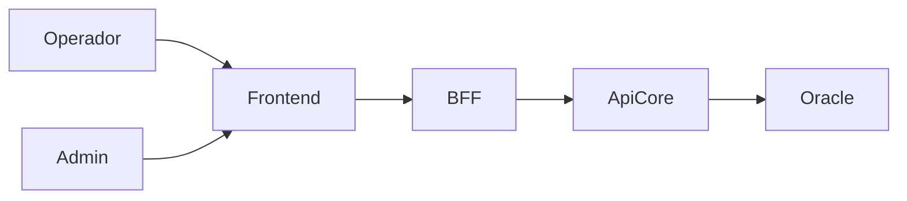

# Documento de Requisitos — Green Park GP-Estacionamento

**Projeto:** Sistema de Estacionamento — Green Park GP-Estacionamento  
**Versão:** 1.0  
**Tipo:** Portfólio / SRS (Software Requirements Specification)  
**Escopo operacional:** Gestão operacional (operador registra entrada, saída e pagamento)  
**Tecnologias previstas:** Angular | BFF Spring Boot | API Core Spring Boot | Oracle | Docker  
**Fora de escopo nesta versão:** cancelas, OCR de placa, pagamento self-service, integração com hardware

---

## 1. Visão geral do produto

Sistema web para gestão de estacionamento com registro de veículos, controle de vagas, cálculo de tarifas (hora, diária e plano mensal), recebimento de pagamentos e relatórios operacionais/financeiros.

Fluxo lógico previsto (sem detalhar implementação):

---

## 2. Atores do sistema

| Ator                        | Descrição                                                                                           |
| --------------------------- | --------------------------------------------------------------------------------------------------- |
| **Operador**                | Registra entrada/saída, aplica tipo de cobrança, recebe pagamento, consulta veículos no pátio       |
| **Administrador**           | Gerencia usuários, tarifas, vagas, planos mensais, parâmetros e relatórios gerenciais               |
| **Cliente / Motorista**     | Interage fora do sistema (entrega ticket, paga, usa plano); não possui portal nesta versão          |
| **Titular de Plano Mensal** | Pessoa física/jurídica vinculada a um ou mais veículos com direito de estacionar no período vigente |
| **Sistema**                 | Atores técnicos: jobs de expiração de plano, auditoria, geração de números de ticket                |

---

## 3. Glossário

- **Ticket:** comprovante lógico da estadia (número único, placa, entrada, status)
- **Estadia:** período entre entrada e saída de um veículo
- **Pátio:** conjunto de veículos atualmente estacionados
- **Fraçao de hora:** qualquer minuto iniciando uma nova hora conta como hora cheia
- **Diária:** cobrança de valor fixo por período de até 24h (regra detalhada abaixo)
- **Plano mensal:** direito de uso por vigência (mês civil ou 30 dias — ver RN)
- **Tabela horária:** valores progressivos de 1 a 7h + excedente

---

## 4. Premissas e restrições

1. Operação 100% mediada por operador autenticado.
2. Diária e mensal são **parametrizáveis** no sistema.
3. Valores iniciais sugeridos (ajustáveis pelo Administrador):
  - **Diária:** R$ 45,00
  - **Plano mensal (1 veículo):** R$ 350,00
  - **Plano mensal (veículo adicional):** R$ 280,00
4. Tabela horária inicial conforme regra fornecida (também parametrizável).
5. Moeda: BRL (R$).
6. Um estacionamento / uma unidade nesta versão.
7. Não há app do cliente nem reserva online nesta versão.

---

## 5. Requisitos funcionais

### 5.1 Autenticação e acesso

- **RF01** — Autenticar usuário com login e senha.
- **RF02** — Encerrar sessão (logout) e expirar sessão por tempo de inatividade.
- **RF03** — Controlar acesso por perfil (Operador, Administrador).
- **RF04** — Bloquear/desativar usuário sem excluir histórico.

### 5.2 Cadastros mestres

- **RF05** — Administrador cadastra, altera e consulta usuários.
- **RF06** — Administrador configura capacidade total de vagas e status (ativa/inativa).
- **RF07** — Administrador mantém tabela de preços por hora (1–7h e valor excedente).
- **RF08** — Administrador mantém valor da diária e regras associadas.
- **RF09** — Administrador mantém valores e regras do plano mensal.
- **RF10** — Sistema registra histórico de alteração de tarifas (quem, quando, valores anteriores).

### 5.3 Entrada de veículo

- **RF11** — Operador registra entrada informando placa (obrigatória) e, opcionalmente, modelo/cor/observação.
- **RF12** — Sistema gera número único de ticket e data/hora de entrada.
- **RF13** — Sistema impede nova entrada se a placa já estiver com estadia aberta no pátio.
- **RF14** — Sistema alerta (e permite ou bloqueia conforme parâmetro) quando o pátio estiver lotado.
- **RF15** — Se a placa possuir plano mensal vigente, sistema identifica automaticamente e classifica a estadia como “mensalista”.
- **RF16** — Operador visualiza ticket gerado para informar o motorista.

### 5.4 Consulta e pátio

- **RF17** — Consultar veículo por placa ou número do ticket.
- **RF18** — Listar veículos no pátio com tempo decorrido e tipo de cobrança previsto.
- **RF19** — Exibir ocupação atual (vagas ocupadas / capacidade / percentual).

### 5.5 Saída, cobrança e pagamento

- **RF20** — Operador inicia saída por placa ou ticket.
- **RF21** — Sistema calcula tempo de permanência (entrada → saída) com precisão de minuto.
- **RF22** — Sistema calcula valor conforme modalidade:
  - Horária (tabela + excedente)
  - Diária
  - Mensal (isento de cobrança avulsa se plano vigente e veículo vinculado)
- **RF23** — Operador pode selecionar/alterar modalidade de cobrança antes do pagamento, dentro das regras (ex.: converter hora → diária quando vantajoso ou a pedido).
- **RF24** — Sistema sugere automaticamente a menor tarifa entre horária e diária quando a permanência atingir o limiar configurado (regra de “melhor preço”), se parâmetro ativo.
- **RF25** — Registrar pagamento com forma: dinheiro, PIX, cartão débito/crédito (registro manual nesta versão).
- **RF26** — Permitir pagamento parcial apenas se parâmetro permitir; caso contrário, exigir quitação total para liberar saída.
- **RF27** — Encerrar estadia somente após pagamento quitado (exceto mensalista vigente e saídas administrativas autorizadas).
- **RF28** — Emitir comprovante de pagamento (visualização/impressão/PDF simples).
- **RF29** — Registrar cancelamento de saída com motivo (antes da confirmação final).

### 5.6 Plano mensal

- **RF30** — Cadastrar titular (nome, documento, contato).
- **RF31** — Vincular uma ou mais placas ao plano.
- **RF32** — Definir vigência (data início / data fim) e valor cobrado.
- **RF33** — Registrar pagamento/renovação do plano.
- **RF34** — Consultar status do plano (ativo, a vencer, vencido, cancelado).
- **RF35** — Renovar plano preservando histórico de períodos.
- **RF36** — Suspender ou cancelar plano com motivo.
- **RF37** — Alertar operador na entrada/saída quando plano estiver vencido ou próximo do vencimento.
- **RF38** — Impedir benefício de mensalista se plano vencido/suspenso (cobrar como avulso).

### 5.7 Operações especiais

- **RF39** — Registrar perda de ticket: localizar por placa, aplicar taxa de 2ª via/perda (parametrizável) e seguir cobrança normal.
- **RF40** — Registrar saída administrativa / cortesia / isenção com perfil Administrador (ou Operador com autorização) e motivo obrigatório.
- **RF41** — Corrigir placa digitada incorretamente em estadia aberta, com auditoria.
- **RF42** — Registrar veículo de serviço/funcionário com regra de isenção configurável.

### 5.8 Relatórios e dashboard

- **RF43** — Dashboard: ocupação, entradas do dia, faturamento do dia, planos a vencer.
- **RF44** — Relatório de movimentação (entradas/saídas) por período.
- **RF45** — Relatório financeiro (faturamento por forma de pagamento, modalidade e período).
- **RF46** — Relatório de veículos no pátio (posição atual).
- **RF47** — Relatório de planos mensais (ativos, vencidos, renovações).
- **RF48** — Relatório de isenções/cortesias/saídas administrativas.
- **RF49** — Exportar relatórios em CSV e/ou PDF.

### 5.9 Auditoria

- **RF50** — Registrar trilha de auditoria de operações críticas (login, entrada, saída, pagamento, alteração de tarifa, plano, isenção, correção de placa).

---

## 6. Requisitos não funcionais

### 6.1 Desempenho

- **RNF01** — Registro de entrada/saída deve concluir em até 3 segundos sob carga típica de portfólio.
- **RNF02** — Consultas de pátio e ticket devem responder em até 2 segundos para até 500 veículos no pátio.

### 6.2 Disponibilidade e confiabilidade

- **RNF03** — Disponibilidade alvo 99% em horário comercial (ambiente Docker local/homologação de portfólio).
- **RNF04** — Transações de pagamento/saída devem ser atômicas (não encerrar estadia sem registrar pagamento correspondente).
- **RNF05** — Backup/restore documentado do banco Oracle (procedimento, mesmo que manual).

### 6.3 Segurança

- **RNF06** — Senhas armazenadas com hash seguro (nunca texto puro).
- **RNF07** — Comunicação HTTPS em ambientes publicados; em local, rede isolada Docker.
- **RNF08** — Autorização por perfil em todas as APIs (não apenas na UI).
- **RNF09** — Proteção contra acesso não autenticado ao BFF/API.
- **RNF10** — Logs sem dados sensíveis completos (ex.: mascarar cartão; placa pode ser logada para operação).

### 6.4 Usabilidade

- **RNF11** — Fluxos de entrada e saída priorizados na tela principal do operador (mínimo de cliques).
- **RNF12** — Interface responsiva para desktop; uso em tablet é desejável.
- **RNF13** — Mensagens de erro claras em português.
- **RNF14** — Campos de placa com normalização (maiúsculas, sem máscara rígida Mercosul/antiga — aceitar ambos os formatos).

### 6.5 Manutenibilidade e arquitetura

- **RNF15** — Separação Frontend → BFF → API Core → Oracle.
- **RNF16** — BFF apenas roteamento/auth/agregação; regras de cobrança e domínio na API Core.
- **RNF17** — Código e APIs documentados o suficiente para demonstração de portfólio.
- **RNF18** — Subir stack via Docker Compose.

### 6.6 Compatibilidade

- **RNF19** — Frontend compatível com Chrome e Edge (últimas 2 versões).
- **RNF20** — API com contrato REST versionável (ex.: `/api/v1`).

### 6.7 Auditoria e conformidade operacional

- **RNF21** — Toda alteração financeira e de tarifa deve ser rastreável.
- **RNF22** — Horário do servidor como fonte da verdade para cálculo (sincronizado).

### 6.8 Observabilidade

- **RNF23** — Health checks dos serviços.
- **RNF24** — Logs estruturados de erros e operações críticas.

---

## 7. Casos de uso

### 7.1 Lista de casos de uso

| ID   | Caso de uso                          | Ator principal     |
| ---- | ------------------------------------ | ------------------ |
| UC01 | Autenticar no sistema                | Operador / Admin   |
| UC02 | Gerenciar usuários                   | Administrador      |
| UC03 | Configurar tarifas e parâmetros      | Administrador      |
| UC04 | Configurar capacidade de vagas       | Administrador      |
| UC05 | Registrar entrada de veículo         | Operador           |
| UC06 | Consultar veículo / ticket           | Operador           |
| UC07 | Listar pátio e ocupação              | Operador           |
| UC08 | Registrar saída e calcular cobrança  | Operador           |
| UC09 | Receber pagamento e encerrar estadia | Operador           |
| UC10 | Aplicar diária                       | Operador           |
| UC11 | Cadastrar titular e plano mensal     | Administrador      |
| UC12 | Vincular veículos ao plano           | Administrador      |
| UC13 | Renovar / suspender / cancelar plano | Administrador      |
| UC14 | Identificar mensalista na entrada    | Sistema / Operador |
| UC15 | Registrar perda de ticket            | Operador           |
| UC16 | Conceder isenção / cortesia          | Administrador      |
| UC17 | Corrigir placa de estadia aberta     | Operador / Admin   |
| UC18 | Emitir comprovante                   | Operador           |
| UC19 | Consultar dashboard                  | Operador / Admin   |
| UC20 | Emitir relatórios                    | Administrador      |
| UC21 | Auditar operações                    | Administrador      |
| UC22 | Encerrar sessão                      | Operador / Admin   |

### 7.2 Priorização sugerida (MVP → evolução)

**MVP (entrega demonstrável):** UC01, UC05–UC10, UC03 (mínimo), UC07, UC18, UC19 (básico)  
**Fase 2:** UC11–UC14, UC15–UC17, UC02, UC04  
**Fase 3:** UC20–UC21 (relatórios avançados e auditoria completa)

---

## 8. Regras de negócio

### 8.1 Cobrança por hora (fornecida)

| Permanência         | Valor                                     |
| ------------------- | ----------------------------------------- |
| 1ª hora (ou fração) | R$ 17                                     |
| 2 horas             | R$ 20                                     |
| 3 horas             | R$ 24                                     |
| 4 horas             | R$ 27                                     |
| 5 horas             | R$ 30                                     |
| 6 horas             | R$ 33                                     |
| 7 horas             | R$ 36                                     |
| Acima de 7 horas    | R$ 36 + R$ 3 por hora ou fração excedente |

**RN01 — Contagem por fração:** qualquer minuto que inicie uma nova hora conta a hora cheia.  
Ex.: 1h01 → cobra 2 horas (R$ 20).

**RN02 — Tempo zero:** permanência < 1 minuto pode ser configurada como tolerância de cancelamento de entrada (padrão: 5 minutos sem cobrança se saída imediata por erro).

### 8.2 Diária e mensal (parametrizáveis — valores iniciais sugeridos)

**RN03 — Diária:** valor fixo sugerido **R$ 45,00** cobrindo até 24 horas contínuas a partir da entrada.  
**RN04 — Ultrapassagem de diária:** após 24h, inicia nova diária (ou retorna à tabela horária — parâmetro; padrão: nova diária).  
**RN05 — Plano mensal:** valor sugerido **R$ 350,00** / veículo / vigência; adicional **R$ 280,00**.  
**RN06 — Vigência do plano:** padrão **mês civil** (início no dia da contratação até o mesmo dia do mês seguinte − 1, ou período 30 dias — parâmetro; padrão: 30 dias corridos).

### 8.3 Regras adicionais recomendadas (estacionamento real)

**RN07 — Tolerância de saída após pagamento:** 15 minutos após quitação para retirar o veículo; excedente reabre cobrança proporcional (ou taxa fixa).  
**RN08 — Melhor preço:** se horária acumulada ≥ valor da diária, cobrar diária automaticamente (parâmetro ligado por padrão).  
**RN09 — Lotação:** bloquear novas entradas avulsas com 100% de ocupação; mensalistas podem ter prioridade (parâmetro).  
**RN10 — Placa única no pátio:** não permitir duas estadias abertas para a mesma placa.  
**RN11 — Formato de placa:** aceitar padrão antigo e Mercosul; normalizar para maiúsculas sem caracteres especiais.  
**RN12 — Perda de ticket:** taxa parametrizável (sugerida R$ 20) + cobrança do tempo pela placa.  
**RN13 — No-show de mensalidade:** após vencimento, carência de 3 dias (parâmetro) com alerta; depois cobra avulso.  
**RN14 — Limite de veículos por plano:** configurável (padrão 1; permite adicionais).  
**RN15 — Troca de placa no plano:** permitida com auditoria; não permitir placa em dois planos ativos.  
**RN16 — Veículo de serviço:** cadastro de placas isentas (funcionários/fornecedores) com validade.  
**RN17 — Estadia órfã / pernoite sem pagamento:** alerta no dashboard para veículos acima de X horas sem previsão de saída.  
**RN18 — Sangria / fechamento de caixa:** consolidar valores do turno do operador (desejável na Fase 2).  
**RN19 — Estorno:** somente Administrador, com motivo, vinculando ao pagamento original.  
**RN20 — Alteração de tarifa:** não recalcula estadias já encerradas; aplica apenas a cálculos futuros (ou a partir de data de vigência da tarifa).  
**RN21 — Horário de funcionamento:** se configurado, alertar entradas fora do horário (não bloquear por padrão).  
**RN22 — Observação obrigatória** em isenção, estorno, correção de placa e cancelamento de plano.  
**RN23 — Arredondamento monetário:** 2 casas decimais, half-up.  
**RN24 — Comprovante:** deve conter ticket, placa, entrada, saída, tempo, modalidade, valor, forma de pagamento e operador.  
**RN25 — Segurança operacional:** operador não altera tarifas; apenas Administrador.

---

## 9. Regras de cálculo — exemplos

| Entrada → Saída    | Tempo    | Modalidade   | Valor                  |
| ------------------ | -------- | ------------ | ---------------------- |
| 10:00 → 10:40      | 40 min   | Hora         | R$ 17                  |
| 10:00 → 11:01      | 1h01     | Hora         | R$ 20                  |
| 10:00 → 17:00      | 7h       | Hora         | R$ 36                  |
| 10:00 → 18:10      | 8h10     | Hora         | R$ 36 + 2×R$ 3 = R$ 42 |
| 10:00 → 22:00      | 12h      | Melhor preço | min(horária, diária)   |
| Mensalista vigente | qualquer | Mensal       | R$ 0 na saída avulsa   |

---

## 10. Escopo explícito fora desta versão

- Cancela automática / sensor / OCR
- App do motorista / reserva online
- Gateway de pagamento real (PIX/cartão automático)
- Multiempresa / multiestacionamento
- Vagas mapeadas por setor/andar (mapa visual)
- Integração com fiscal/NFC-e (opcional futuro)
- Biometria / reconhecimento facial

---

## 11. Critérios de aceite transversais (amostra)

1. Dado veículo sem plano, ao sair após 2h05, sistema cobra R$ 24.
2. Dado mensalista vigente, saída não gera cobrança avulsa.
3. Dado plano vencido, saída calcula tarifa horária/diária normalmente.
4. Dado pátio lotado e parâmetro de bloqueio ativo, nova entrada avulsa é recusada.
5. Dado alteração de tarifa, tickets já pagos permanecem inalterados.
6. Apenas Administrador altera preços; Operador executa entrada/saída/pagamento.

---

## 12. Entregável desta etapa

Ao aprovar este plano, o artefato será persistido como documento Markdown estruturado (ex.: `docs/REQUISITOS-GP-ESTACIONAMENTO.md`) **sem geração de código**.

Nenhuma implementação Angular/Spring/Docker será iniciada nesta etapa.