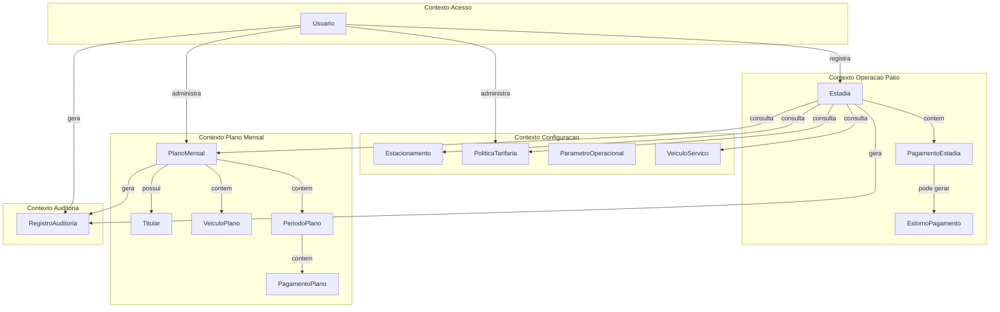
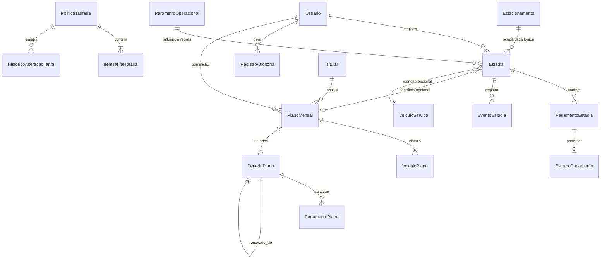
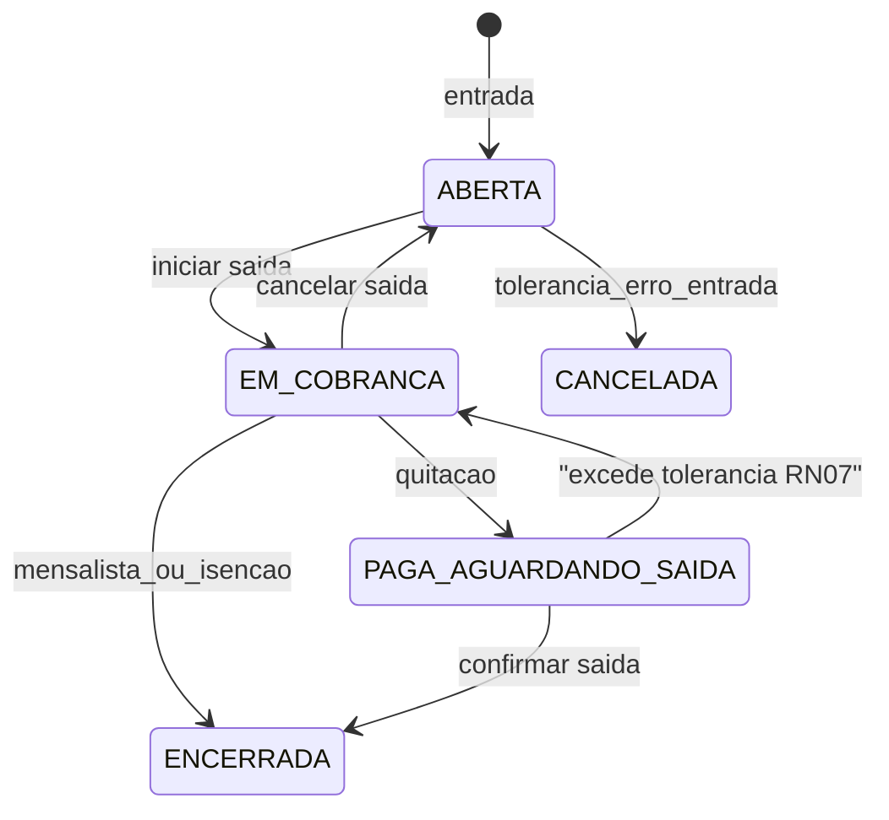
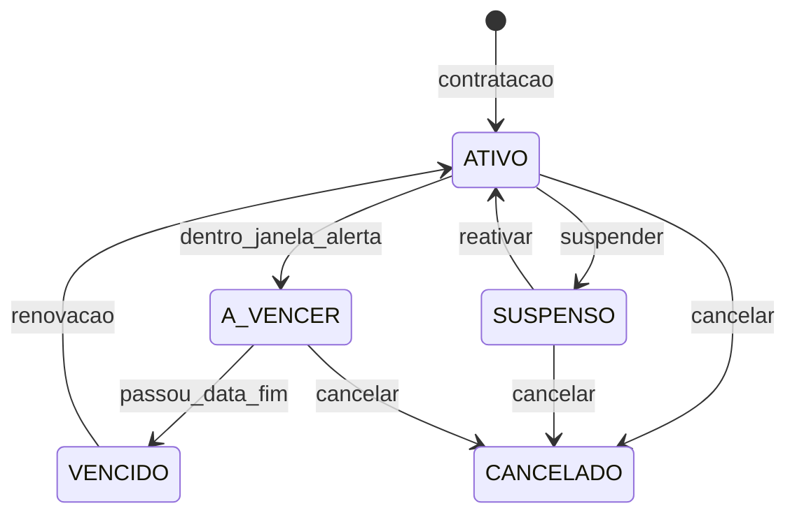

# Modelo de Domínio — Green Park GP-Estacionamento

**Base:** [documento_requisitos_gp-estacionamento_a851089c.plan.md](.cursor/plans/documento_requisitos_gp-estacionamento_a851089c.plan.md)  
**Abordagem:** Domain-Driven Design (agregados + entidades + value objects)  
**Escopo:** uma unidade de estacionamento; operação mediada por operador  
**Fora deste artefato:** código, SQL, APIs, UI

---

## 1. Visão do mapa de domínio

---

## 2. Agregados (raiz e fronteira)

| Agregado (raiz) | Entidades internas | Value Objects | Invariantes principais |
| --- | --- | --- | --- |
| **Usuario** | — | Credencial, NomeUsuario | login único; senha nunca em claro; desativar sem apagar |
| **Estacionamento** | — | CapacidadeVagas, HorarioFuncionamento | uma unidade; capacidade ≥ 1 quando ativa |
| **PoliticaTarifaria** | ItemTarifaHoraria, HistoricoAlteracaoTarifa | ValorMonetario, VigenciaTarifa | tabela 1–7h + excedente; alteração não recalcula estadias encerradas |
| **ParametroOperacional** | — | chaves tipadas | parâmetros de comportamento (lotação, melhor preço, tolerâncias) |
| **Estadia** | PagamentoEstadia, EstornoPagamento, EventoEstadia | Placa, NumeroTicket, TempoPermanencia, ValorMonetario | placa única no pátio; encerrar só com quitação (exceto isenção/mensalista válido) |
| **Titular** | — | Documento, Contato | documento válido; titular reutilizável entre planos ao longo do tempo |
| **PlanoMensal** | VeiculoPlano, PeriodoPlano, PagamentoPlano | Vigencia, ValorMonetario | placa em no máximo um plano ativo; benefício só com período vigente |
| **VeiculoServico** | — | Placa, Vigencia | isenção só dentro da validade |
| **RegistroAuditoria** | — | MetadadosAuditoria | append-only; não altera registros anteriores |
| **TurnoCaixa** *(Fase 2)* | MovimentoCaixa | — | consolidação por operador/turno (RN18) |

**Decisão arquitetural:** `Titular` é agregado próprio (não embutido só no plano) para permitir histórico de múltiplos planos/renovações sem duplicar pessoa. `PoliticaTarifaria` é a fonte da verdade de preços; `Estadia` **consulta** tarifas no cálculo, mas **congela** valores no momento do pagamento.

---

## 3. Entidades, atributos e responsabilidades

### 3.1 Usuario (AR)

**Responsabilidade:** autenticar, autorizar e representar quem executa operações.

| Atributo | Tipo conceitual | Obrigatório | Notas |
| --- | --- | --- | --- |
| id | Identidade | sim | |
| nome | texto | sim | |
| login | texto único | sim | |
| senhaHash | segredo | sim | RNF06 |
| perfil | enum PerfilUsuario | sim | OPERADOR / ADMINISTRADOR |
| status | enum StatusUsuario | sim | ATIVO / BLOQUEADO / DESATIVADO |
| dataCriacao | datahora | sim | |
| dataUltimoAcesso | datahora | não | |
| dataInativacao | datahora | não | |

**Regras:** RF01–RF05, RF04 (bloquear sem excluir), RN25 (só admin altera tarifas).

---

### 3.2 Estacionamento (AR)

**Responsabilidade:** representar a unidade física e a capacidade do pátio.

| Atributo | Tipo | Obrig. | Notas |
| --- | --- | --- | --- |
| id | Identidade | sim | singleton lógico nesta versão |
| nome | texto | sim | ex.: Green Park |
| capacidadeTotalVagas | inteiro | sim | RF06 |
| status | enum StatusEstacionamento | sim | ATIVO / INATIVO |
| horarioAbertura | horário | não | RN21 |
| horarioFechamento | horário | não | RN21 |
| alertarForaHorario | booleano | sim | padrão true; não bloqueia |

**Regras:** RF06, RF14, RN09, RN21.

---

### 3.3 PoliticaTarifaria (AR)

**Responsabilidade:** manter preços vigentes e histórico de mudanças.

#### PoliticaTarifaria

| Atributo | Tipo | Obrig. | Notas |
| --- | --- | --- | --- |
| id | Identidade | sim | |
| vigenciaInicio | datahora | sim | RN20 |
| vigenciaFim | datahora | não | null = vigente |
| valorDiaria | ValorMonetario | sim | RN03; sugestão 45,00 |
| regraUltrapassagemDiaria | enum RegraUltrapassagemDiaria | sim | NOVA_DIARIA (padrão) / RETORNA_HORARIA |
| valorHoraExcedente | ValorMonetario | sim | RN tabela >7h |
| ativo | booleano | sim | |

#### ItemTarifaHoraria (entidade interna)

| Atributo | Tipo | Obrig. | Notas |
| --- | --- | --- | --- |
| id | Identidade | sim | |
| quantidadeHoras | inteiro 1–7 | sim | |
| valor | ValorMonetario | sim | tabela RN seção 8.1 |

#### HistoricoAlteracaoTarifa (entidade interna)

| Atributo | Tipo | Obrig. | Notas |
| --- | --- | --- | --- |
| id | Identidade | sim | |
| dataAlteracao | datahora | sim | |
| usuarioId | ref Usuario | sim | |
| valoresAnteriores | snapshot | sim | RF10 |
| valoresNovos | snapshot | sim | |
| motivo | texto | não | |

**Regras:** RF07–RF10, RN01, RN03, RN04, RN08, RN20, RN23, RN25.

---

### 3.4 ParametroOperacional (AR)

**Responsabilidade:** centralizar flags e limiares configuráveis (não são “preço”, são comportamento).

| Chave (conceitual) | Tipo | Padrão sugerido | RN/RF |
| --- | --- | --- | --- |
| bloquearEntradaQuandoLotado | bool | true | RN09 |
| mensalistaTemPrioridadeNaLotacao | bool | true | RN09 |
| melhorPrecoAtivo | bool | true | RN08 / RF24 |
| toleranciaEntradaMinutos | int | 5 | RN02 |
| toleranciaSaidaAposPagamentoMinutos | int | 15 | RN07 |
| taxaPerdaTicket | ValorMonetario | 20,00 | RN12 |
| carenciaPlanoVencidoDias | int | 3 | RN13 |
| limiteVeiculosPorPlano | int | 1 (+adicionais) | RN14 |
| valorPlanoMensalVeiculo | ValorMonetario | 350,00 | RN05 |
| valorPlanoMensalAdicional | ValorMonetario | 280,00 | RN05 |
| tipoVigenciaPlano | enum | DIAS_CORRIDOS_30 | RN06 |
| permitirPagamentoParcial | bool | false | RF26 |
| alertaEstadiaLongaHoras | int | configurável | RN17 |
| diasAlertaPlanoAVencer | int | configurável | RF34/RF37 |

Cada parâmetro guarda: `chave`, `valor`, `tipoValor`, `descricao`, `alteradoPor`, `alteradoEm`.

---

### 3.5 Estadia (AR) — núcleo operacional

**Responsabilidade:** ciclo de vida da permanência no pátio (entrada → cobrança → pagamento → saída).

| Atributo | Tipo | Obrig. | Notas |
| --- | --- | --- | --- |
| id | Identidade | sim | |
| numeroTicket | NumeroTicket | sim | único; RF12 |
| placa | Placa | sim | normalizada; RN11 |
| modelo | texto | não | RF11 |
| cor | texto | não | |
| observacao | texto | não | |
| dataHoraEntrada | datahora | sim | relógio servidor; RNF22 |
| dataHoraSaida | datahora | não | preenchida na saída |
| status | enum StatusEstadia | sim | ver enums |
| modalidadeCobranca | enum ModalidadeCobranca | sim | pode mudar antes do pagamento; RF23 |
| modalidadeSugerida | enum ModalidadeCobranca | não | melhor preço; RF24 |
| valorCalculado | ValorMonetario | não | |
| valorTaxaPerdaTicket | ValorMonetario | não | RN12 |
| valorTotal | ValorMonetario | não | cálculo + taxas − isenções |
| valorPago | ValorMonetario | não | soma pagamentos quitados |
| planoMensalId | ref PlanoMensal | não | se identificado mensalista |
| veiculoServicoId | ref VeiculoServico | não | se isento serviço |
| motivoIsencao | texto | condicional | RN22 |
| tipoSaidaEspecial | enum TipoSaidaEspecial | não | ADMINISTRATIVA / CORTESIA / ISENCAO |
| ticketPerdido | booleano | sim | padrão false |
| operadorEntradaId | ref Usuario | sim | |
| operadorSaidaId | ref Usuario | não | |
| dataHoraQuitacao | datahora | não | base da tolerância RN07 |
| versao | concurrency | sim | atomicidade saída/pagamento; RNF04 |

#### PagamentoEstadia (entidade interna)

| Atributo | Tipo | Obrig. | Notas |
| --- | --- | --- | --- |
| id | Identidade | sim | |
| dataHora | datahora | sim | |
| valor | ValorMonetario | sim | > 0 |
| formaPagamento | enum FormaPagamento | sim | RF25 |
| status | enum StatusPagamento | sim | |
| operadorId | ref Usuario | sim | |
| comprovanteEmitido | booleano | sim | RF28 / RN24 |

#### EstornoPagamento (entidade interna)

| Atributo | Tipo | Obrig. | Notas |
| --- | --- | --- | --- |
| id | Identidade | sim | |
| pagamentoOrigemId | ref PagamentoEstadia | sim | RN19 |
| dataHora | datahora | sim | |
| valor | ValorMonetario | sim | |
| motivo | texto | sim | RN22 |
| administradorId | ref Usuario | sim | só Admin |

#### EventoEstadia (entidade interna / trilha local)

| Atributo | Tipo | Obrig. | Notas |
| --- | --- | --- | --- |
| id | Identidade | sim | |
| tipo | enum TipoEventoEstadia | sim | CORRECAO_PLACA, CANCELAMENTO_SAIDA, etc. |
| dataHora | datahora | sim | |
| usuarioId | ref Usuario | sim | |
| valorAnterior | texto/json | não | ex.: placa antiga |
| valorNovo | texto/json | não | |
| motivo | texto | condicional | RN22 |

**Responsabilidades do AR Estadia:**
- Abrir estadia e gerar ticket
- Impedir placa duplicada no pátio (RN10)
- Classificar mensalista/serviço na entrada (RF15, RN16)
- Calcular permanência e valor (RF21–RF24, RN01–RN08)
- Registrar perda de ticket (RF39)
- Aceitar mudança de modalidade dentro das regras (RF23)
- Registrar pagamentos / exigir quitação (RF25–RF27)
- Encerrar, cancelar saída, corrigir placa, isentar (RF29, RF40, RF41)

---

### 3.6 Titular (AR)

**Responsabilidade:** pessoa física/jurídica dona do direito de plano.

| Atributo | Tipo | Obrig. | Notas |
| --- | --- | --- | --- |
| id | Identidade | sim | |
| nome | texto | sim | RF30 |
| tipoPessoa | enum TipoPessoa | sim | PF / PJ |
| documento | Documento | sim | CPF/CNPJ |
| telefone | texto | não | |
| email | texto | não | |
| ativo | booleano | sim | |

---

### 3.7 PlanoMensal (AR)

**Responsabilidade:** direito de uso por vigência para placas vinculadas.

| Atributo | Tipo | Obrig. | Notas |
| --- | --- | --- | --- |
| id | Identidade | sim | |
| titularId | ref Titular | sim | |
| status | enum StatusPlano | sim | derivado + explícito |
| limiteVeiculos | inteiro | sim | RN14 |
| dataCadastro | datahora | sim | |
| motivoSuspensaoCancelamento | texto | condicional | RF36, RN22 |

#### VeiculoPlano (entidade interna)

| Atributo | Tipo | Obrig. | Notas |
| --- | --- | --- | --- |
| id | Identidade | sim | |
| placa | Placa | sim | única entre planos ativos; RN15 |
| dataVinculo | datahora | sim | |
| dataDesvinculo | datahora | não | troca de placa |
| ativo | booleano | sim | |

#### PeriodoPlano (entidade interna)

| Atributo | Tipo | Obrig. | Notas |
| --- | --- | --- | --- |
| id | Identidade | sim | |
| dataInicio | data | sim | RF32 |
| dataFim | data | sim | |
| valorCobrado | ValorMonetario | sim | 350 + adicionais |
| quantidadeVeiculos | inteiro | sim | |
| statusPeriodo | enum StatusPeriodoPlano | sim | VIGENTE / ENCERRADO / RENOVADO |
| renovadoDePeriodoId | ref PeriodoPlano | não | RF35 histórico |

#### PagamentoPlano (entidade interna)

| Atributo | Tipo | Obrig. | Notas |
| --- | --- | --- | --- |
| id | Identidade | sim | |
| periodoPlanoId | ref | sim | |
| dataHora | datahora | sim | RF33 |
| valor | ValorMonetario | sim | |
| formaPagamento | enum FormaPagamento | sim | |
| operadorId | ref Usuario | sim | |

**Responsabilidades:** cadastrar, vincular placas, renovar preservando períodos, suspender/cancelar, responder “placa tem benefício agora?” (RF30–RF38, RN05, RN06, RN13–RN15).

---

### 3.8 VeiculoServico (AR)

**Responsabilidade:** placas isentas (funcionário/fornecedor) com validade.

| Atributo | Tipo | Obrig. | Notas |
| --- | --- | --- | --- |
| id | Identidade | sim | |
| placa | Placa | sim | |
| descricao | texto | sim | |
| tipo | enum TipoVeiculoServico | sim | FUNCIONARIO / FORNECEDOR / OUTRO |
| dataInicio | data | sim | |
| dataFim | data | não | |
| ativo | booleano | sim | |

**Regras:** RF42, RN16.

---

### 3.9 RegistroAuditoria (AR append-only)

**Responsabilidade:** trilha imutável de operações críticas (RF50, RNF21).

| Atributo | Tipo | Obrig. | Notas |
| --- | --- | --- | --- |
| id | Identidade | sim | |
| dataHora | datahora | sim | |
| usuarioId | ref Usuario | não | sistema também |
| tipoOperacao | enum TipoOperacaoAuditoria | sim | |
| entidadeAfetada | texto | sim | |
| entidadeId | texto | sim | |
| detalhe | snapshot | sim | sem dados sensíveis completos; RNF10 |
| ipOrigem | texto | não | |

---

### 3.10 TurnoCaixa (AR — Fase 2 / RN18)

**Responsabilidade:** consolidar recebimentos do turno do operador.

| Atributo | Tipo | Obrig. |
| --- | --- | --- |
| id | Identidade | sim |
| operadorId | ref Usuario | sim |
| abertura | datahora | sim |
| fechamento | datahora | não |
| status | enum StatusTurno | sim |
| totalDinheiro / Pix / Cartões | ValorMonetario | derivados |

Incluído no modelo para completude do SRS; implementação pode ficar fora do MVP.

---

## 4. Value Objects

| VO | Conteúdo | Validações |
| --- | --- | --- |
| **Placa** | valor normalizado | maiúsculas; só A–Z0–9; aceitar antigo e Mercosul; RN11 / RNF14 |
| **NumeroTicket** | sequência única | gerado pelo sistema; imutável |
| **ValorMonetario** | decimal BRL | ≥ 0 (exceto estorno conceitual negativo no movimento); 2 casas half-up; RN23 |
| **Documento** | CPF ou CNPJ | dígitos válidos conforme TipoPessoa |
| **TempoPermanencia** | minutos totais | derivado entrada→saída; base RN01 |
| **Vigencia** | inicio/fim | fim ≥ início |
| **CapacidadeVagas** | inteiro | > 0 |
| **HorarioFuncionamento** | abertura/fechamento | coerência do intervalo |
| **Credencial** | login + hash | login não vazio; hash obrigatório |

---

## 5. Enums

| Enum | Valores |
| --- | --- |
| **PerfilUsuario** | OPERADOR, ADMINISTRADOR |
| **StatusUsuario** | ATIVO, BLOQUEADO, DESATIVADO |
| **StatusEstacionamento** | ATIVO, INATIVO |
| **StatusEstadia** | ABERTA, EM_COBRANCA, PAGA_AGUARDANDO_SAIDA, ENCERRADA, CANCELADA |
| **ModalidadeCobranca** | HORARIA, DIARIA, MENSAL, ISENTA_SERVICO, CORTESIA, ADMINISTRATIVA |
| **FormaPagamento** | DINHEIRO, PIX, CARTAO_DEBITO, CARTAO_CREDITO |
| **StatusPagamento** | REGISTRADO, ESTORNADO |
| **TipoSaidaEspecial** | NENHUMA, ADMINISTRATIVA, CORTESIA, ISENCAO |
| **TipoEventoEstadia** | ENTRADA, INICIO_SAIDA, CANCELAMENTO_SAIDA, CORRECAO_PLACA, PERDA_TICKET, ALTERACAO_MODALIDADE, PAGAMENTO, ESTORNO, ENCERRAMENTO |
| **StatusPlano** | ATIVO, A_VENCER, VENCIDO, SUSPENSO, CANCELADO |
| **StatusPeriodoPlano** | VIGENTE, ENCERRADO, RENOVADO, CANCELADO |
| **TipoVigenciaPlano** | MES_CIVIL, DIAS_CORRIDOS |
| **TipoPessoa** | PESSOA_FISICA, PESSOA_JURIDICA |
| **TipoVeiculoServico** | FUNCIONARIO, FORNECEDOR, OUTRO |
| **RegraUltrapassagemDiaria** | NOVA_DIARIA, RETORNA_HORARIA |
| **TipoOperacaoAuditoria** | LOGIN, LOGOUT, ENTRADA, SAIDA, PAGAMENTO, ESTORNO, ALTERACAO_TARIFA, PLANO, ISENCAO, CORRECAO_PLACA, PARAMETRO, USUARIO |
| **StatusTurno** | ABERTO, FECHADO *(Fase 2)* |

---

## 6. Relacionamentos

**Cardinalidades-chave:**
- 1 placa → no máximo **1 Estadia ABERTA** (RN10)
- 1 placa → no máximo **1 VeiculoPlano ativo** em planos não cancelados/suspensos de forma que gerem benefício (RN15)
- 1 Estadia → N Pagamentos (parcial se parâmetro permitir)
- 1 Pagamento → 0..1 Estorno
- 1 PlanoMensal → 1 Titular; N VeiculoPlano; N PeriodoPlano
- 1 PoliticaTarifaria vigente → N ItemTarifaHoraria (exatamente 7 faixas + excedente na política)

**Relacionamentos que NÃO são FK rígida de agregação:** Estadia referencia PlanoMensal / VeiculoServico / Politica por **ID** (referência entre agregados), nunca por navegação mutável cruzando fronteira de consistência.

---

## 7. Regras de validação e negócio por agregado

### Usuario
- Login único; perfil obrigatório
- Só ATIVO autentica
- Desativar/bloquear preserva histórico (RF04)

### Estacionamento / lotação
- Ocupação = contagem de Estadias ABERTA (+ opcionalmente PAGA_AGUARDANDO_SAIDA, conforme política de vaga)
- Se lotado e `bloquearEntradaQuandoLotado`: recusar avulso; mensalista pode entrar se prioridade ativa (RN09, RF14)

### PoliticaTarifaria / cálculo
- **RN01:** horas cobradas = ceil(minutos / 60); mínimo 1 hora se acima da tolerância
- **RN02:** se permanência ≤ tolerância e saída por erro → valor 0 / cancelamento
- Faixas 1–7 + excedente (seção 8.1)
- **RN03/RN04:** diária cobre 24h; ultrapassagem conforme enum
- **RN08/RF24:** se melhor preço ativo → `min(horária, diária)` (e múltiplos de diária se aplicável)
- **RN20:** mudança de tarifa não altera estadias ENCERRADAS
- **RN23:** half-up 2 casas
- **RN25:** só ADMINISTRADOR altera

### Estadia — entrada
- Placa obrigatória e normalizada (RF11, RN11)
- Recusar se já houver estadia aberta mesma placa (RF13, RN10)
- Se plano vigente para placa → modalidade MENSAL (RF15)
- Se VeiculoServico válido → ISENTA_SERVICO (RN16)
- Alertar plano a vencer / vencido (RF37); vencido sem carência → avulso (RF38, RN13)

### Estadia — saída / pagamento
- Tempo com precisão de minuto (RF21)
- Modalidade alterável antes da quitação (RF23)
- Pagamento parcial só se parâmetro (RF26)
- ENCERRADA somente se: quitada **ou** MENSAL vigente **ou** saída especial autorizada (RF27, RF40)
- Perda de ticket: taxa + cobrança normal (RN12)
- Tolerância pós-pagamento 15 min (RN07)
- Cancelamento de saída com motivo antes da confirmação final (RF29)
- Correção de placa em estadia aberta com auditoria (RF41, RN22)
- Estorno: só Admin + motivo + vínculo ao pagamento (RN19)
- Comprovante: ticket, placa, entrada, saída, tempo, modalidade, valor, forma, operador (RN24)

### PlanoMensal
- Valor = 350 × 1º + 280 × adicionais (parametrizável) (RN05)
- Vigência: 30 dias corridos (padrão) ou mês civil (RN06)
- Limite de veículos (RN14)
- Renovação cria novo PeriodoPlano e preserva anterior (RF35)
- Suspender/cancelar com motivo (RF36, RN22)
- Após vencimento: carência 3 dias com alerta; depois avulso (RN13)
- Troca de placa auditada; placa não pode estar em dois planos ativos (RN15)

### VeiculoServico
- Isenção só se ativo e dentro da vigência (RN16)

### Auditoria
- Operações críticas sempre registradas (RF50): login, entrada, saída, pagamento, tarifa, plano, isenção, correção de placa

---

## 8. Serviços de domínio (não-entidade)

Não são entidades; orquestram regras que cruzam agregados:

| Serviço | Função |
| --- | --- |
| **CalculadoraTarifa** | Aplica tabela horária, diária, melhor preço, ultrapassagem, arredondamento |
| **ServicoIdentificacaoBeneficio** | Resolve se placa é mensalista vigente, em carência ou veículo de serviço |
| **ServicoOcupacaoPatio** | Calcula ocupação e aplica política de lotação |
| **ServicoNormalizacaoPlaca** | Normaliza e valida formato |
| **PoliticaAutorizacaoOperacao** | Quem pode isentar, estornar, alterar tarifa, corrigir placa |

---

## 9. Estados relevantes

---

## 10. Modelo completo — resumo executivo

**Entidades / ARs:** Usuario, Estacionamento, PoliticaTarifaria (+ ItemTarifaHoraria, HistoricoAlteracaoTarifa), ParametroOperacional, Estadia (+ PagamentoEstadia, EstornoPagamento, EventoEstadia), Titular, PlanoMensal (+ VeiculoPlano, PeriodoPlano, PagamentoPlano), VeiculoServico, RegistroAuditoria, TurnoCaixa (Fase 2).

**Relacionamentos centrais:** Usuario opera Estadia; Estadia referencia benefício (Plano/Serviço) e congela cobrança a partir de PoliticaTarifaria; PlanoMensal agrega Titular + veículos + períodos + pagamentos; Auditoria observa tudo.

**Atributos:** detalhados nas seções 3.x.

**Regras de negócio associadas:** RN01–RN25 e RF aplicáveis mapeados por agregado na seção 7; cálculos exemplificados no SRS §9 permanecem a especificação de aceitação da CalculadoraTarifa.

---

## 11. Entregável desta etapa

Persistir este modelo como documento Markdown de arquitetura de domínio (ex.: `docs/MODELO-DOMINIO-GP-ESTACIONAMENTO.md`) **sem código e sem SQL**, após sua aprovação.

Nenhuma implementação Angular/Spring/Oracle nesta etapa.
